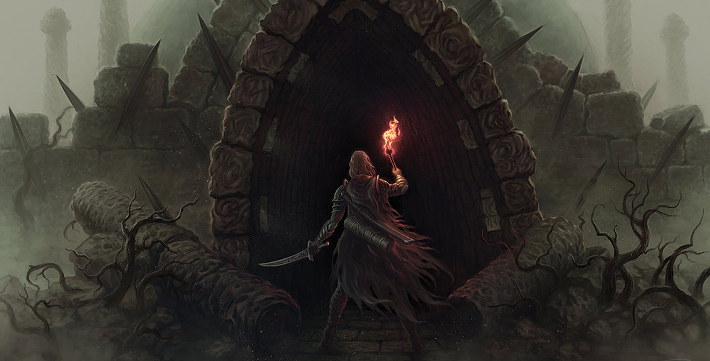

#  Greetings All!
Welcome to my GitHub!

My name is Javier Tamez and I am a software engineer that believes coding is a craft that is meant to be enjoyed by everyone.

I love stories. We live them, breathe them, and make them intentionally or without thought. When we write code it is a story that is enacted faithfully by our mechanical storytellers (computers). They act(method) out each character(object) according to the scripts(code) and props(data) we give them. Sure the occasional typo(bug) will cause chaos, but we as authors(developers) are also part of the show(product).

I say this so you can share in my joy when visiting my work. Feel free to reach out to me and schedule a chat on [Linkedin](https://www.linkedin.com/in/javier-tamez/).

##  Contact Details:
🌱 Currently looking for work :)

Resume: [Public Resume](https://docs.google.com/document/d/108FOg323Tvo0_gLL_rF1ExxItyJYgDeS3QqVsiDcmH8/edit?usp=sharing)

Email: [prowling.lynx1@gmail.com](prowling.lynx1@gmail.com)

Linkedin: [Javier Tamez](https://www.linkedin.com/in/javier-tamez/)

Portfolio: Under construction :]

## Currently Learning
Learning more about Java. I love Javascript and all of its weirdness, but there is something fun about the way Java describes itself. Still learning how to implement OOP principles seamlessly into my Java code.

I'm also studying c# on the side. Mostly for how similar it feels to Java.

##  Tech
<!--  -->

  
  
  
  
  
  
  
  
  
  
  
  
  
  
  
  
  
  
  
  
  
  

##  Books
These are some books I've found looking through GitHub. I do not own any of them or was the one to create the repository. Still, if anything is amiss feel free to reach out to me. [Contact](#contact-me)
- [Eloquent Javascript](https://eloquentjavascript.net/) - Written by Marijn Haverbeke. I highly recommend reading this book if you are new to javascript.
- [Books for programmers](https://github.com/ProwlingLynx/Book-For-Programmers/tree/master) - link to the original [repo](https://github.com/rajucs/Book-For-Programmers)
- [BookBank](https://github.com/ProwlingLynx/BookBank)- link to the original [repo](https://github.com/ajitpal/BookBank)
- [You don't know JS](https://github.com/ProwlingLynx/You-Dont-Know-JS) -link to the original [repo](https://github.com/getify/You-Dont-Know-JS)

<!-- https://api.github.com/repos/:owner/:repo/contents/:path -->

<!--
**ProwlingLynx/ProwlingLynx** is a ✨ _special_ ✨ repository because its `README.md` (this file) appears on your GitHub profile.

Here are some ideas to get you started:

- 🔭 I’m currently working on ...
- 🌱 I’m currently learning ...
- 👯 I’m looking to collaborate on ...
- 🤔 I’m looking for help with ...
- 💬 Ask me about ...
- 📫 How to reach me: ...
- 😄 Pronouns: ...
- ⚡ Fun fact: ...
-->
