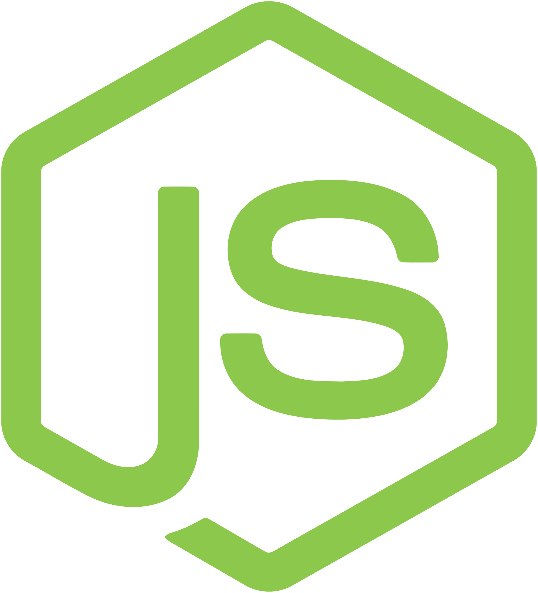

# Greetings All!

Hello and welcome!

If you are coming from my gaming group, then send me an in game request and I will send you a link with instructions on how to run my GAS scripts. I am not looking for contributors at this time.

If you are coming from my Bitbucket, then be aware I will be closing that account in the near future. I do not plan to move the projects here.

Otherwise, feel free to look around and check out some of my past projects and what I might be working on.

## What I am Planning

I am taking a break from Google App Script (GAS) development and my freelance work. Currently I am pursuing my degree in Computer Science at San Jacinto (Graduation: 2027-28) and will be working on my core engineering skills in the mean time.

## Why Cats?

I like cats. They are better than dogs :P

Honestly, I find cats to be an interesting animal that catches peoples attention. It also doesn't hurt that I like cat pictures too. These images I created using the DALL-E 2 AI image creator. In some ways these pictures tell a story if you start in reverse order.

If you have some cat images you want to share or chat in general then hit me up on <a href="https://www.linkedin.com/in/javier-tamez/" target="_blank">LinkedIn</a>

## Tech
<!--  -->

  
  
  
  
  
  
  
  
  
  
  
  
  
  
  
  
  
  
  
  
  
  

<!--
**ProwlingLynx/ProwlingLynx** is a ✨ _special_ ✨ repository because its `README.md` (this file) appears on your GitHub profile.

Here are some ideas to get you started:

- 🔭 I’m currently working on ...
- 🌱 I’m currently learning ...
- 👯 I’m looking to collaborate on ...
- 🤔 I’m looking for help with ...
- 💬 Ask me about ...
- 📫 How to reach me: ...
- 😄 Pronouns: ...
- ⚡ Fun fact: ...
-->
